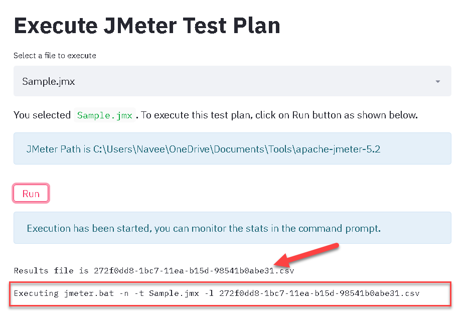
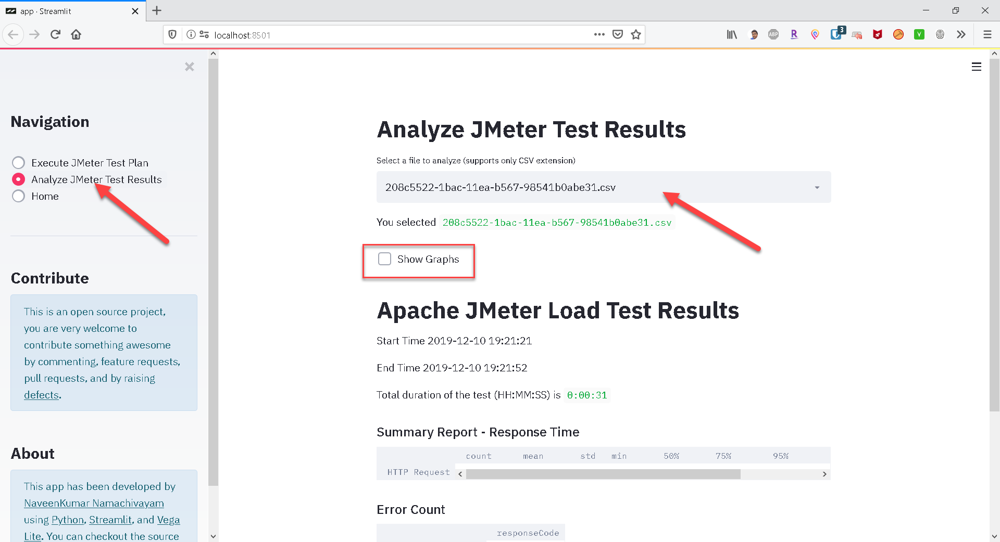
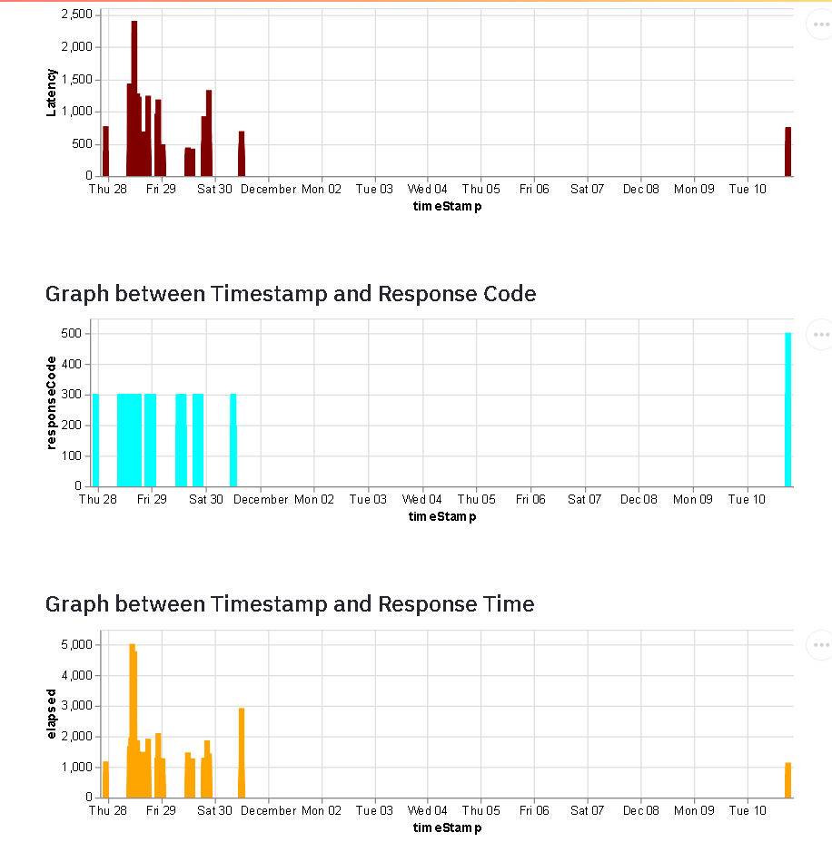

# Powering up Apache JMeter with Streamlit

## Overview

Apache JMeter is an open source load testing tool written in 100% pure Java. JMeter supports umpteen protocols including HTTP(S), FTP, SMTP, Web Services, JMS and much more. In JMeter, you can generate HTML results after you done with the execution or you can use Backend Listeners to monitor the runtime results. 

Streamlit is an open source framework for Machine Learning and Data Sciences team. You can build tools to visualize the data and interactive prototypes.

## Apache JMeter + Streamlit

By integrating Streamlit with Apache JMeter, you can build machine learning models to train to detect anomalies from your JMeter test results. This project is just a beginning where you can execute and visualize the test results in interactive charts.

## Prerequisities

* [Apache JMeter](https://jmeter.apache.org/download_jmeter.cgi)
* Your favorite IDE (I ❤ [VS Code](https://code.visualstudio.com/))
* [Python 2.7.0 or later / Python 3.6.x or later](https://www.python.org/downloads/)
* [PIP](https://pip.pypa.io/en/stable/installing/)
* [Streamlit](https://streamlit.io/docs/index.html)

Use the latest version as possible.

## Streamlit Installation

I prefer [Anaconda](https://www.anaconda.com/) to install the Streamlit, you can follow the instructions mentioned [here](https://streamlit.io/docs/getting_started.html).

## JMeter Installation

[Getting Started](https://jmeter.apache.org/usermanual/get-started.html#running) with JMeter.

## Streamlit Hello World

After installing all the necessary components, you could run a `hello` program by invoking `streamlit hello`. This will open a browser (or new tab). You can run Streamlit from your Github Gists, e.g. `streamlit run https://raw.githubusercontent.com/streamlit/demo-uber-nyc-pickups/master/app.py`

## Streamlit + JMeter

By leveraging Streamlit with JMeter which brings machine learning capabailities to detect the anamolies and to study the performance of your application. Using this repo, you can run your JMeter scripts and visualize the results instantly.

Streamlit brings intuitive user interface for your JMeter execution and results analysis.

### Prerequisite

* Set the environment variable `JMETER_HOME` pointing to your `apache-jmeter` folder. E.g. `C:\apache-jmeter-5.2`
* Make sure the changes are propogated in your system. You may need to kill the explorer or restart your system.
* You can check the changes are reflected by issuing the command `%JMETER_HOME` in the command prompt.

### Launch

* Run the below command to get started
  
`python -m pip install -r .\requirements.txt`

* Clone this repository and navigate into it.
* In the command prompt, enter the below command

`streamlit run app.py`

* In case of powershell, issue the below command

`streamlit run .\app.py`

* This will open a new tab or launch the default browser with the URL http://localhost:8501
* You could see the `About` page

### Execute JMeter Test Plan

To execute JMeter test plan, click on left sidebar widget and then click on `Execute JMeter Test Plan` radio button. This will bring up the page where you can select the JMeter test plan as shown below.

After selecting the JMX file, click on `Run` button to execute the JMeter test plan. This will execute your test plan in CLI mode and generates unique log file and place it in the `bin` folder.

At top right corner, you could see the progress of the app.

To monitor the performance, go to the command prompt which display the run time stats.

If you would like to stop the script execution, go to the command prompt and issue the `CTRL + C` shortcut.

### Analyze

To analyze the test results, click on `Analyze JMeter Test Results` radio button which will bring up the page as shown below. Select the csv file to analyze which will display the metrics such as start time, end time, summart report etc. 

To view the graphs, click on `Show Graphs` check box.

All the graphs are interactive, on need basis you can generate variety of combinations by custom coding. Under the hood, graphs plotted using `vega-lite`.

### Limitations
* Supports only CSV results
* By default, it fetches all the files from the JMETER_HOME folder. 
* Limited number of charts has been added, other type of charts can be added by custom coding.

### Known Issues
* Doesn't execute if the JMeter file name which has space
* Quick Navigation between Execute and Analyze may break the code, you may need to launch the app again.
* Doesn't display the JMeter test results runtime

### What's next?

* This is just a inception version where I experimented the capabilties of `streamlit`. The next big thing is writing a training model to detect the anamolies and predict the point of failure which is work-in-progress.

### Notes

* I am not a professional developer nor a good open-source maintainer. My code may not have the standards, but it will do its job if everything is propertly set.

